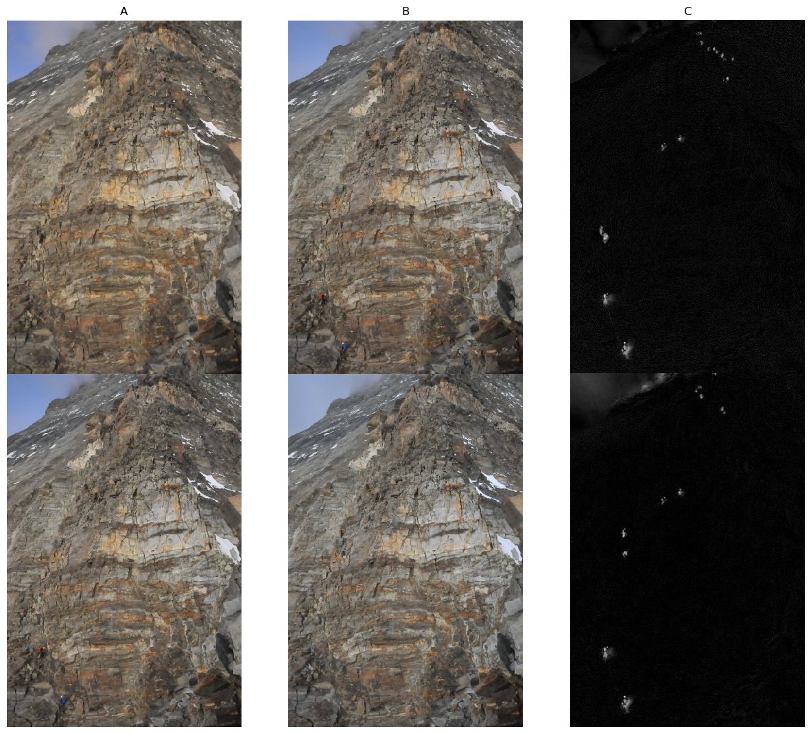
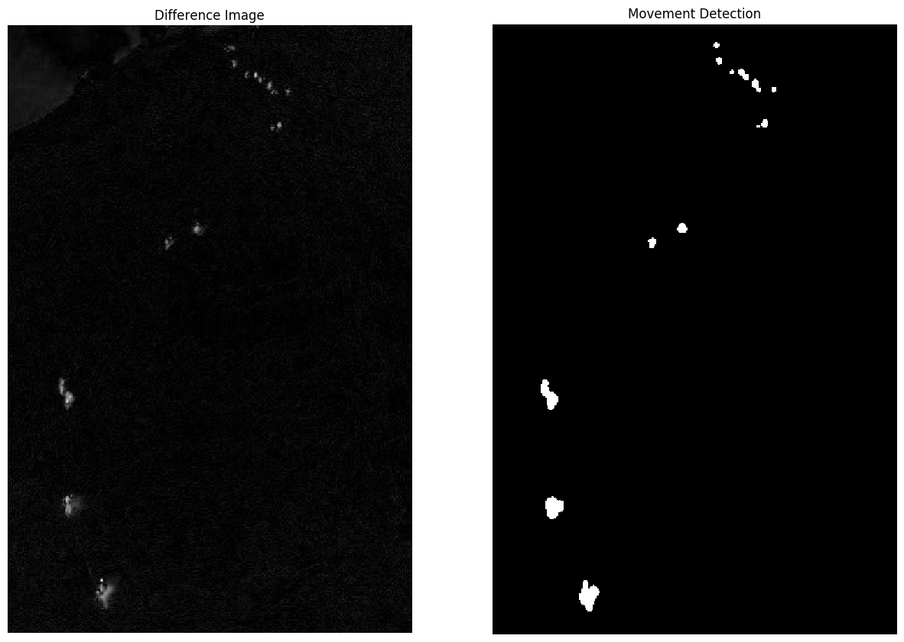

<div>

</div>
<br>
<br>

# Unsupervised Movement Detection

## Overview
This repo is a summary of the Permafrost Hackathon, which took place at the ETH Zurich end of November 2019.
For more background information check the following [blogpost](https://www.statworx.com/ch/blog).

The presented code and approach is the result of Team Aroma.
Visit the Hackathon [repo](https://github.com/ETHZ-TEC/permafrostanalytics) for other contributions.

## Our Goal

Our team focused on the detection of movements on stationary images. Below is an example. It might be hard to spot but there are mountaineers on the pictures. However, the pictures are four minutes apart. In column C the difference image (A - B) is depicted. Clearly, the movements of mountaineers can be spotted.



There is some noise in the difference image from alterations in light. Hence, we implemented a method (based on Turgay Celik's paper *Unsupervised Change Detection in Satellite Images Using Principal Components Analysis and k-Means Clustering, 2009*) to extract the relevant movements/changes in our sequential images. Check the comparison below. 




## Data
Visit the above mentioned hackathon repo to download the relevant data source.
For reproducability only the data source `timelapse_images_fast.zip` is necessary.

### Folder Structure
Make sure your folder structure looks like this:

```
.
├── 00_input
│   └── image001.jpg
├── 01_data
│   └── timelapse_images_fast
│       ├── 2017-01-01
│           ├── 20170101_070009.JPG
│           ├── 20170101_070409.JPG
│           └── ...
│       ├── 2017-01-02
│       └── ...
├── 02_code
│   ├── helperfunctions.py
│   └── movement_detection.py
├── LICENSE
├── README.md
├── requirements.txt
└── setup.sh
```

## Contact
If there are any questions, don't hesitate to shoot me an [email](fran.peric@statworx.com).